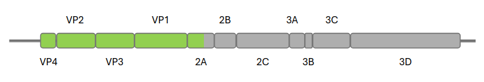
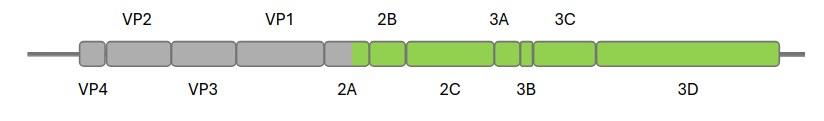

# Enterovirus genotyping

## Prerequisites

Ensure that the following programs/packages are installed on your system before running the pipeline:

- nextflow v24.04.3
- python3 y modulos:
    - sys
    - re
    - os
    - SeqIO, Seq, CodonTable 
    - pandas
- Trimmomatic v0.39
- bowtie2 v2.5.1
- bbduk.sh (https://github.com/BioInfoTools/BBMap/tree/master)
- SPAdes v3.13.1
- blastn v2.14.0+
- diamond v2.1.10.164
- seqkit v2.5.1

Ensure that the paths in the nextflow.config are pointing the correct folder.

## Execution Overview

The execution of the scripts varies depending on the user's input. There are two main options:

- **FASTQs**: The user uploads FASTQ files for genome assembly.
- **FASTA**: The user uploads a file with sequences or pastes the sequences into a designated field.

### Input Options

#### FASTQs

The user must provide the sample ID, FASTQ file names (R1 and R2), and the FASTQ files. This can be done in two ways:
- Via an online form (user uploads information, and a `samples-list.csv` file is created with the provided data).
- Direct batch upload of a CSV file.

**`samples-list.csv` format (without headers):**

| Sample ID  | FASTQ1 Name | FASTQ2 Name |
|------------|------------|------------|
| 10196548   | 10196548_S2_L001_R1.fastq.gz | 10196548_S2_L001_R2.fastq.gz |
| sample1    | sample1_S32_L001_R1.fastq.gz | sample1_S32_L001_R2.fastq.gz |

Save the file path in a consistent location and include the path in `nextflow.config > params.file`.
An example is included in the genotyping-nf folder.

**Script Execution:**
```sh
nextflow run enterovirus-genotyping.nf --input fastq
```

#### Sequencing Approaches

Different sequencing approaches can be used with additional script options:

- **Partial VP1 Region**: If amplification targets a partial VP1 region, resulting in small fragments (<1000 nucleotides, typically 200-500 nt), it **MUST** be specified (default assumes whole genome sequencing).
- **Whole Genome**: Achieved through full-genome amplification or metagenomic/shotgun methods. Expected output: complete genome (~7500 nt) or amplicons of 3000-5000 nt.

To specify partial VP1 region sequencing, add:
```sh
nextflow run enterovirus-genotyping.nf --input fastq --protocol partial
```

If primers were used and need to be filtered from FASTQs, add:
```sh
nextflow run enterovirus-genotyping.nf --input fastq --primers /fullPath/file.fasta
```

A FASTA file with primer sequences should be provided by the user. An example is available in `files/primers.fasta`.

Both options (`partial` + `primers`) can be combined:
```sh
nextflow run enterovirus-genotyping.nf --input fastq --protocol partial --primers /fullPath/file.fasta
```

#### FASTA

The user provides sequences either by uploading a multifasta file or pasting sequences in a designated area. Regardless of input method, sequences should be saved in a FASTA file and passed as a parameter.

**Script Execution:**
```sh
nextflow run enterovirus-genotyping.nf --input fasta --fastaFile sequences.fasta
```

### Output

Regardless of whether the input is FASTQ or FASTA, the genotyping output follows the same format:

**Example CSV Output:**

| Match | Seq ID | Start | End | Species | Genotype |
|--------|--------|------|------|---------|----------|
| E-18   | 10196548_1 | 7 | 3508 | Enterovirus betacoxsackie | E-18 |
| EV-B84 | 10196548_2 | 3480 | 7422 | Enterovirus betacoxsackie | EV-B84 |
| EV-D68 | sample1 | 22 | 7365 | Enterovirus deconjuncti | EV-D68 (B3) |

All relevant output files (for database storage or visualization) are saved in `[SAMPLE_ID]/RESULTS`.

### Visualization Proposal

Based on [RIVM Enterovirus Typing Tool](https://www.rivm.nl/mpf/typingtool/enterovirus):

| Name | Species | Genotype | Genome |
|------|--------|---------|--------|
| 10196548_1 | Enterovirus betacoxsackie | E-18 |  |
| 10196548_2 | Enterovirus betacoxsackie | EV-B84 |  |
| sample1 | Enterovirus deconjuncti | EV-D68 (B3) |  |
